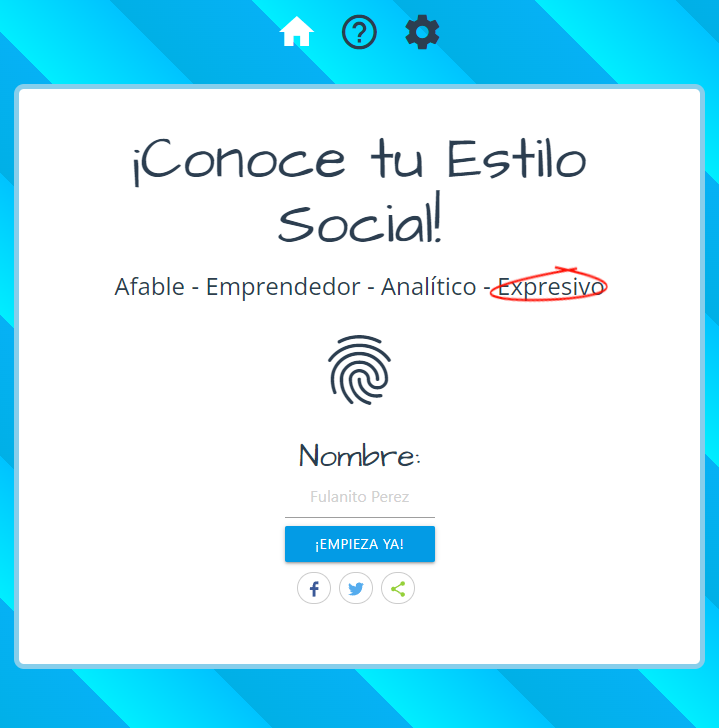
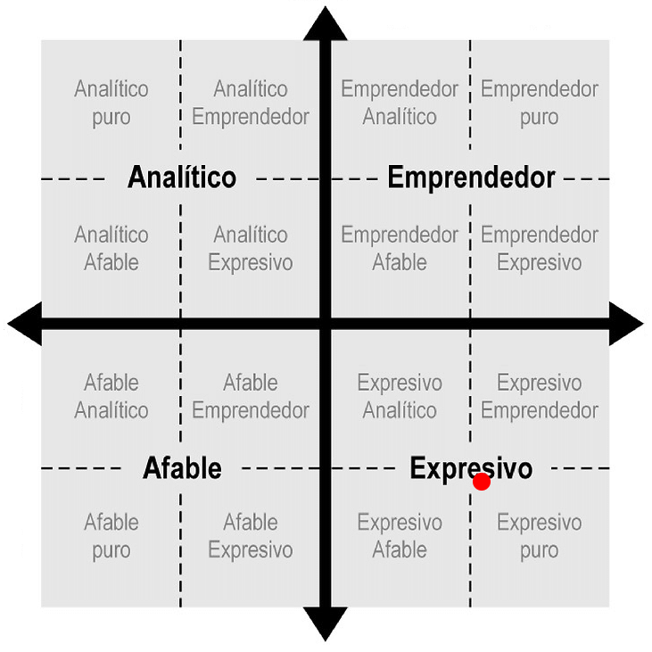
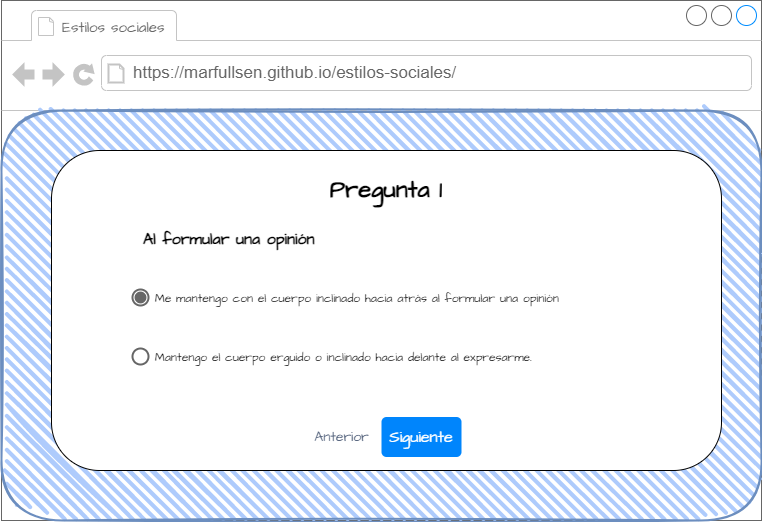

<p align="center">
  <a href="https://marfullsen.github.io/estilos-sociales/" rel="noopener">
 </a>
</p>

<div align="center">

# ¡Conoce tu estilo social!

[](https://marfullsen.github.io/estilos-sociales/)
[](https://v3.vuejs.org/)
[](https://cli.vuejs.org/)
[](https://router.vuejs.org/)
[](https://materializecss.com/)

</div>

<p align="center">
  Test interactivo para obtener información sobre estilos sociales
</p>

## 📝 Contenidos

- [¿Qué es el test de estilos sociales?](#about)
- [Por hacer](#todo)
- [¡Empecemos!](#getting_started)
- [Fase de producción](#deployment)
- [ejecución](#usage)
- [Tecnologías usadas](#built_using)
- [Autores](#authors)
- [Referencias](#acknowledgement)

## 🧐 ¿Qué es el test de estilos sociales? <a name = "about"></a>

<p align="center">
  <a href="https://marfullsen.github.io/estilos-sociales/" rel="noopener">
 </a>
</p>

El test de estilo social de relación interpersonal, según el modelo de Bolton, es una prueba de alternativas que permite obtener los niveles de asertividad y emotividad de una persona, con ambos valores se puede determinar el estilo social al que pertenece.

## Por hacer  <a name = "todo"></a>

- Tabla de resultados competitivos
- Detalles estéticos.
- Estadísticas y métricas de uso.

## 🏁 ¡Empecemos! <a name = "getting_started"></a>

Primeros pasos:

Para iniciar la prueba sólo escribe tu nombre y dale click al botón "¡Empezar!"

Luego de responder las 18 preguntas obtendrás un mapa con tu estilo social marcado con un punto rojo.

<p align="center">
  <a href="https://marfullsen.github.io/estilos-sociales/" rel="noopener">
 </a>
</p>

Además se incluye información sobre el estilo obtenido, niveles de asertividad y emotividad.

### Requisitos previos

#### Para realizar el test

- Un navegador (Chrome, Firefox, Edge, Opera, Safari)
- Ir a [marfullsen.rocks/estilos-sociales/](https://marfullsen.github.io/estilos-sociales/)
- Realizar el test, no se necesita instalación previa.

#### Para editar el código y recompilar

- Node.js
- Vue + Vue-CLI + Vue-Router

### Instalación


```
git clone https://github.com/Marfullsen/estilos-sociales.git

cd estilos-sociales

npm install

```

## 🔧 Correr las pruebas <a name = "tests"></a>

```
npm run test:unit
```

## 🎈 Ejecución <a name="usage"></a>

```
npm run serve
```

- Abrir el navegador en la url especificada en consola, posiblemente [127.0.0.1:8080](http://localhost:8080/)

## 🚀 Fase de producción <a name = "deployment"></a>

Cuando se pase a la fase de producción, se recomienda **crear un archivo llamado 404.html** con el mismo contenido que tiene el archivo **index.html**, esto para lograr que el enrutador de Vue logre redireccionar a la url estándar y no caiga en la página **404.html** que nos provee Github.

## ⛏️ Tecnologías usadas <a name = "built_using"></a>

- [Vue.js](https://vuejs.org/) - Framework de JavaScript para FrontEnd.

## Mockups

<p align="center">
  <a href="https://marfullsen.github.io/estilos-sociales/" rel="noopener">
 </a>
</p>

## ✍️ Autores <a name = "authors"></a>

- [@Marfullsen](https://github.com/Marfullsen) - Desarrollo del proyecto.

## 🎉 Referencias <a name = "acknowledgement"></a>

- [Materialize CSS](https://materializecss.com/)
- favicon de un [portapapeles](https://www.stockio.com/free-icon/stationery-clipboard)
- Share Buttons por [sharethis.com](https://sharethis.com/)
- [La Versatilidad y los 4 Estilos Sociales por Wilson Learning](https://www.businessupgroup.com/post/la-versatilidad-y-los-4-estilos-sociales)